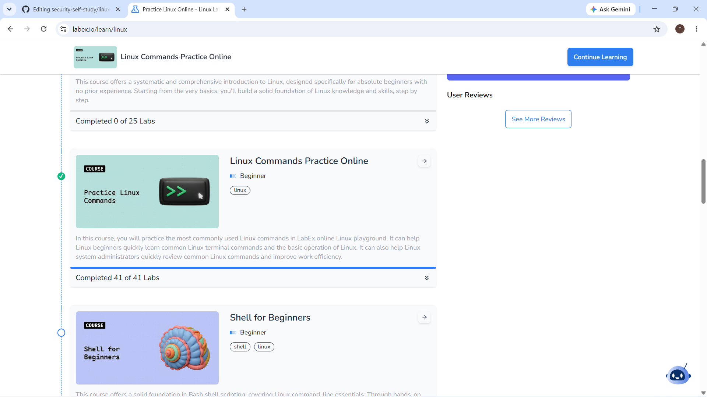
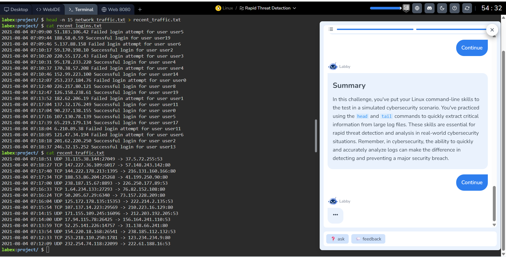

# Linux Commands Practice - LabEx

## Objective
Completed LabEx's "Linux Commands Practice Online" course (41 labs/challenges) to build hands-on command line proficiency across file operations, text processing, file searching, and system monitoring. Skills that are foundational for log analysis and Linux-based security work.

## Course
[LabEx - Linux Commands Practice Online](https://labex.io/courses/linux-basic-commands-practice-online)

## What the Course Covered

### File System Navigation & Management
Practiced core commands for moving around and managing the filesystem: 'ls', 'pwd', 'cd', 'mkdir', 'cp', 'mv', 'rm'.
- Completed two applied challenges: **"Setting Up a New Project Project Structure"** and **"Organizing Files and Directories"**, which required using these commands together to build and reorganize a directory tree rather than running them in isolation.

> Note: replace this with a specific detail once you've gone through it (e.g., In the 'Organizing Files and Directories' challenge, I had to sort files into subdirectories by file type using 'mv' and wildcard patterns.)

### Viewing & Reading Files
Practiced 'cat', 'more', 'less', 'head', 'tail', 'nl'.
- Applied these in the **"Viewing Log and Configuration Files in Linux"** challenge> These are directly relevant to log review, since these are the commands used to page through and inspect log files without opening a full text editor.

### File Searching & Locating
Practiced 'which', 'whereis', 'find', 'grep'.
- Completed the **"Discover Critical System Resources"** and **"Needle in the Haystack"** challenges, which required using 'find' and 'grep' together to locate specific files or lines of text within a larger set of files. This is the same pattern used when searching logs for specific event event or indicator.
- Also completed **"Rapid Threat Detection"**, a challenge framed around quickly locating relevant information under time pressure using search commands.

### Text Processing
Practiced 'wc', 'cut', 'sort', 'uniq', 'tr', 'diff', 'join', 'xargs', 'awk'.
-Completed **'Word Count and Sorting"** and **"Processing Employees Data"**, which required chaining commands together (e.g., 'sort' + 'uniq' to find duplicate or most frequent entries, 'awk' to extract and process structured fields from a data file). This is the same logic used to summarize or de-duplicate log data.

> Note: 'awk' and chaining commands with pipes ('|') is the most advanced/valuable skill in this section (e.g., a command you used to count occurrences of value in a file).

### System Monitoring
Practiced 'top', 'free', 'df', 'du', 'time'.
-Completed **"Disk Usage Detective"**, which required using 'du' and 'df' to identify what was consuming disk space on a system, a real troubleshooting/triage task.

## Why This Matters for Securing Work
Several of these challenges mirror tasks a SOC analyst or incident responder actually does: paging through log files ('less', 'tail'), searching for specific indictors across many files ('grep', 'find'), and summarizing data to spot patterns ('sort', 'uniq', 'awk'). This course connects directly to the log analysis work in my [Splunk SIEM lab](https://github.com/6c2r2fqpmq-a11y/home-siem-lab-splunk). Command-line tools like 'grep' and 'awk' can do locally, on raw log files, much of what SPL does inside Splunk.

## Skills Demonstrated
- File system navigation and management ('ls', 'cd', 'mkdir', 'cp', 'mv', 'rm')
- Log/file inspection ('cat', 'less', 'head', 'tail')
- Pattern searching across files ('find', 'grep')
- Text processing and data summarization ('cut', 'sort', 'uniq', 'awk')
- System resource monitoring ('top', 'free', 'df', 'du')

## Evidence

### Linux Commands Practice Completion

### Rapid Threat Detection Completion

### 
